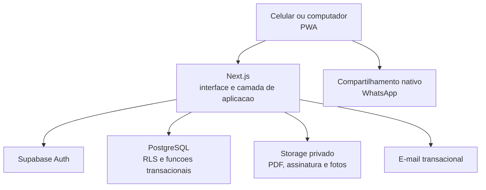

# Arquitetura da solucao

## Decisao

O Sistema de Coleta MJT sera um monolito web independente, com Next.js e TypeScript como aplicacao e Supabase como plataforma de dados. Esta combinacao reduz operacao sem sacrificar banco relacional, autenticacao, armazenamento privado ou autorizacao.



## Responsabilidades

| Componente | Responsabilidade |
| --- | --- |
| Next.js cliente | Telas, validacao imediata, PWA e rascunho offline |
| Next.js servidor | Comandos de negocio, autorizacao complementar, PDF e links seguros |
| PostgreSQL | Dados relacionais, integridade, sequencia, auditoria e consultas |
| Supabase Auth | Sessao, identidade e recuperacao de acesso |
| Supabase Storage | Arquivos privados e organizados por coleta/documento |
| Servico de e-mail | Entrega de guia por e-mail e registro de tentativa |

## Regra de fronteira

O navegador pode ler apenas os dados permitidos ao usuario autenticado. Operacoes criticas passam pela camada do servidor: finalizar coleta, atribuir numero, criar documento, cancelar, alterar estado operacional, compartilhar documento e emitir links.

Nunca expor `service_role`, chaves administrativas, buckets publicos de evidencia ou acesso irrestrito a tabelas.

## Estrutura futura do codigo

```text
sistema-coleta/
  app/                 Next.js App Router: rotas finas e arquivos especiais
    (app)/
    api/
  src/
    _app/              providers, estilos globais e handlers de rota
    _pages/            composicao e logica local de cada rota
    shared/            UI, validacoes genericas, config, auth e acesso a dados
    widgets/           somente blocos reutilizados em 2+ paginas
    features/          somente interacoes reutilizadas em 2+ pontos
    entities/          somente modelos de dominio reutilizados e estaveis
  public/              icones e manifest da PWA
  supabase/            migrations, seeds seguros e politicas
  .agents/skills/      procedimentos locais para Codex
  docs/
```

`app/` nao recebe regra de negocio: rotas reexportam as paginas FSD e Route Handlers delegam para `src/_app/api-routes/`. Comecar com `_app`, `_pages` e `shared`; criar `widgets`, `features` e `entities` somente quando existir reuso comprovado. A regra completa esta em `fsd.md`.

Funcoes utilitarias, validacoes e formatacao nao ficam dentro de handlers HTTP ou componentes de tela. Acesso a dados permanece server-only e retorna DTOs minimos para cada consumidor.

## Ambientes e publicacao

| Ambiente | Finalidade | Regras |
| --- | --- | --- |
| Local | Desenvolvimento individual | Projeto Supabase local ou banco de desenvolvimento isolado |
| Staging | Validacao antes de liberar | Dados sinteticos; sem documentos reais |
| Producao | Operacao MJT | Projeto Supabase, dominio e credenciais proprios |

O deploy sera independente do monorepo raiz. O dominio recomendado e um subdominio dedicado, por exemplo `coleta.seudominio.com.br`; a definicao final depende do dominio institucional disponivel.

## PWA e offline

O sistema sera online-first com suporte a continuidade em campo:

- cache do aplicativo e telas essenciais;
- rascunhos, itens e assinatura temporariamente no dispositivo;
- fila visivel de sincronizacao;
- numero, PDF e envio somente apos confirmacao do servidor;
- aviso claro de pendencia enquanto nao houver sincronizacao.

O rascunho offline nao e prova oficial ate a sincronizacao. Isso evita codigos duplicados e documentos conflitantes.

## Integracoes futuras

Integracoes de NF-e, WhatsApp Business API e ERP ficarao atras de adaptadores de dominio. A coleta nao deve depender da disponibilidade dessas integracoes para ser criada ou consultada.
