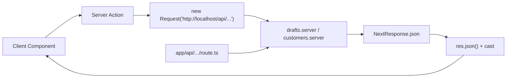
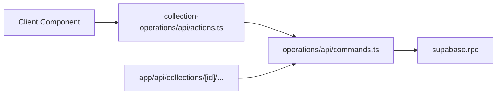
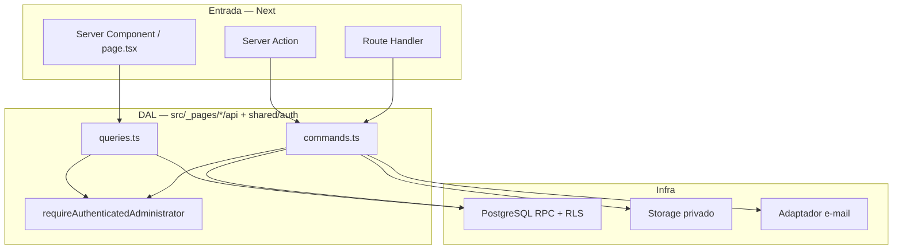

# Architecture improvement — Sistema de Coleta MJT

| Campo | Valor |
| :--- | :--- |
| **Status** | DAL **congelada** (`active` / `normative`). Fases A–H de migração permanecem `planned` — **não autorizam implementação** sem pedido explícito |
| **Authority** | `normative` na decisão DAL (secção abaixo + [ADR 0009](../decisions/0009-data-access-layer.md)). Resto do plano = `informative` |
| **Owner** | product / sistema-coleta |
| **Last verified** | 2026-08-29 |
| **Escopo** | Somente `sistema-coleta/` |
| **Pedido** | Análise explícita do humano; DAL congelada em 2026-08-29 para não reabrir as 3 abordagens do Next.js |

---

## Decisão congelada — Data Access Layer (DAL)

**Binding para toda LLM / agente / humano.** Não relitigar. Não “escolher de novo”. Não misturar.

O [Data Security guide](https://nextjs.org/docs/app/guides/data-security) do Next.js **cataloga** três jeitos de buscar dados (HTTP APIs, DAL, acesso no componente) e pede: *escolher uma e não misturar*. Esse catálogo **não é um menu aberto neste repositório**.

| Abordagem Next.js | Status neste projeto |
| :--- | :--- |
| **Data Access Layer** | **ÚNICA abordagem vigente.** Leituras e mutações. |
| HTTP APIs como fonte de dados interna | **Proibida.** Route Handlers existem só como adaptador fino **sobre** o DAL (contrato público, jobs, QR, testes). Server Component / Server Action **não** `fetch` a própria `/api` e **não** fabricam `new Request("http://localhost/...")`. |
| Component-level data access (query no `page.tsx` / JSX) | **Proibida.** Só protótipo segundo a Next; este app não é protótipo. |

**O que é o DAL aqui (sem ser outra pasta mágica):** módulos `server-only` em `src/_pages/<slice>/api/queries.ts` e `api/commands.ts` (mais `src/shared/auth` para sessão). Autenticam, autorizam perto do dado, chamam RPC/RLS/Storage e devolvem **DTO**. `"use server"` e `app/**/route.ts` só validam input, chamam o DAL e traduzem resultado.

Registro formal: [ADR 0009](../decisions/0009-data-access-layer.md). Lei de preflight: [`AGENTS.md`](../../AGENTS.md).

O resto deste documento (fases A–H) explica o *gap* do código atual em relação a essa lei. Fechar o gap só com pedido explícito e um eixo por PR.

---

Este documento descreve **como** tornar o app mais fácil de ler e manter. Não é um rewrite. Não cria camadas vazias. Não extrai microserviços.

Fontes normativas que o plano de migração **não** enfraquece: [`AGENTS.md`](../../AGENTS.md), [`coding-standards.md`](../coding-standards.md), [`architecture/fsd.md`](../architecture/fsd.md), [`architecture/data-and-rules.md`](../architecture/data-and-rules.md). A DAL congelada **reforça** essas fontes.

---

## 1. Veredito

O projeto **já tem uma arquitetura boa o suficiente**. O problema não é “falta de Clean Architecture”. O problema é **inconsistência entre gerações de código**:

| Geração | Onde | Como o domínio é chamado |
| :--- | :--- | :--- |
| Fase 1 (clientes, rascunho, itens) | `collection-drafts`, `customers` | Função de negócio recebe `Request` e devolve `NextResponse` |
| Fase 2 (documentos) | `collection-documents` | Comandos + portas + saga — o melhor pedaço do app |
| Fase 3 (oficina) | `collection-operations` | Comando tipado → Action fina — o padrão a copiar |
| Casca Next | `app/` | A maior parte é fina; alguns loaders e helpers vazaram para a rota |

A regra de ouro (consequência da DAL congelada):

> **Um comando/query de domínio (DAL). Dois adaptadores finos (Server Action e Route Handler). Nunca um adaptador chamando o outro.**

Isso é o que `collection-operations` já faz. Não exige pasta nova, framework novo, nem OOP de domínio.

---

## 2. O que já está certo — não mexer

Estes pilares devem permanecer. “Melhorar arquitetura” **não** significa substituí-los.

1. **Monólito Next.js + Supabase.** Um framework, um deploy, um domínio. A [orientação da Vercel](https://vercel.com/kb/guide/structure-your-application) é começar pelo single-framework e só separar quando outra linguagem ou ciclo de release independente for necessário. Aqui não é.
2. **Regras críticas no PostgreSQL (RPCs + RLS).** Número oficial, idempotência, `row_version`, transições de estado e auditoria já vivem no banco. O TypeScript **não** deve virar um segundo motor de regras.
3. **FSD progressivo.** `_app` + `_pages` + `shared`. Sem `entities` / `features` / `widgets` vazios. Extração só com reuso real — já está em [`fsd.md`](../architecture/fsd.md) e na skill FSD v2.1 (“start simple, extract when needed”).
4. **Rotas finas na maior parte de `app/`.** Ex.: `app/api/health/route.ts` e `app/api/customers/route.ts` só delegam.
5. **Fronteira server/client.** `server-only`, DTOs, `'use client'` nas folhas. TypeScript estrito.
6. **Portas onde a complexidade pediu.** Offline (`OfflineKvPort`) e geração de PDF (`DocumentJobQueue`, `DocumentArtifactStorage`) já são DIP sem cerimônia.
7. **PWA online-first.** SW só de shell; fila local reusa as actions existentes (ADR 0005 / 0006).

---

## 3. Mapa as-is (como o código está hoje)

```text
sistema-coleta/
  app/                          convenções Next (rotas, layout, route.ts)
    (protected)/                páginas autenticadas — em geral finas
    (public)/                   login, QR, download
    api/                        ~40 Route Handlers (contrato HTTP da Fase 1A + jobs)
  src/
    _app/                       PWA, offline banner, errors, actions-fachada
    _pages/
      login/
      dashboard/
      customers/                HTTP-shaped (Request → NextResponse)
      collection-drafts/        HTTP-shaped + fila offline (boa)
      collection-lifecycle/     comandos/queries tipados (boa)
      collection-operations/    comandos tipados + actions (boa)
      collection-documents/     rendering + delivery + public (melhor isolamento)
      company-settings/
    shared/                     auth, db, ui, config, lib (às vezes vaza domínio)
  supabase/                     source of truth das regras
```

Fluxo real de uma mutação da Fase 1 (o cheiro principal):



A Action **simula HTTP** para chamar uma função que já roda no mesmo processo. Isso duplica serialização, esconde o contrato tipado e torna o stack trace ilegível.

A Fase 3 já evita isso:



---

## 4. Problemas que realmente atrapalham manutenção

Ordenados por impacto. Só estes justificam mudança.

### 4.1 Comando de domínio acoplado a HTTP (Fase 1)

`customers.server.ts` e `drafts.server.ts` misturam, no mesmo arquivo:

- parse de `Request` / `FormData`
- autenticação
- RPC / tabela
- mapeamento DTO
- montagem de `NextResponse`
- logging de 500

As actions em `src/_app/actions/draft-flow.actions.ts` e `src/_pages/collection-drafts/api/actions.ts` então fazem `new Request("http://localhost/...")`, chamam essas funções e fazem parse do JSON com `as`.

Isso viola SRP, dificulta teste unitário do comando e é o oposto do [Data Access Layer do Next.js](https://nextjs.org/docs/app/guides/data-security): Actions devem delegar a um módulo `server-only` que devolve DTO, não `Response`.

### 4.2 Dois jeitos de escrever a mesma coisa

| Superfície | Papel hoje | Problema |
| :--- | :--- | :--- |
| Server Actions | UI autenticada + fila offline | Às vezes encapsulam HTTP interno |
| Route Handlers | Contrato em [`http-api.md`](../http-api.md), jobs internos, público | Necessários — mas não devem ser o “backend” das actions |
| RPCs | Autoridade de negócio | Correto |

Não apagar a API HTTP. Ela serve preview, testes de contrato, workers (`/api/internal/...`) e verificação pública. O erro é **a Action depender da forma HTTP**.

### 4.3 Lógica vazou para `app/`

O FSD do projeto diz: `app/` só reexporta ou delega. Hoje existem arquivos de composição/regra na árvore de rota:

- `app/(protected)/coletas/[id]/load-hub.ts`
- `app/(protected)/coletas/[id]/load-operation.ts` (quase o mesmo que o anterior)
- `app/(protected)/coletas/[id]/oficina/budget-total.ts`
- `app/(protected)/coletas/[id]/page.tsx` monta o view-model do hub (mapeamento que deveria viver no slice)

A [documentação de project structure do Next.js](https://nextjs.org/docs/app/getting-started/project-structure) permite colocation em `app/`, mas **este** repositório já escolheu a estratégia “arquivos fora de `app/`”. Ser consistente é mais importante do que a opção teórica.

### 4.4 Duplicação de primitivos

Cópias quase literais entre slices:

| Primitivo | Onde se repete |
| :--- | :--- |
| `digestSha256` / `digestLifecycleRequest` / `validatePngSignature` | `collection-lifecycle/api/commands.ts` e `collection-operations/api/commands.ts` |
| Client Supabase + cookies | `supabase-server.ts`, `lifecycle-supabase.ts`, `operations-supabase.ts`, verificação pública |
| `verifyCollectionDocument` | `collection-documents/api/public/verification.ts` — o duplicado em `api/public-verification.ts` foi removido (scan 5.16, `30d8621`) |
| Helpers HTTP (`noStore`, parse JSON, idempotency) | `http-response.ts` vs funções locais em drafts/customers |
| Mapeamento de erro de domínio → mensagem | `lifecycle-errors.ts` vs `action-error.ts` vs `operations-errors.ts` |

Não criar um “utils.ts” genérico. Extrair **só** esses primitivos nomeados, para `shared/lib/` (infra) ou um único módulo de erro de comando.

### 4.5 `shared/` já carrega um pouco de domínio

[`fsd.md`](../architecture/fsd.md): *“`shared` não recebe regra de negócio de coleta”*.

Hoje `src/shared/model/collection-status.ts` tem status canônicos, filtro da lista e labels. É o sintoma clássico de “ainda não extraímos `entities/collection`”. Aceitável como **ponte**. Não crescer mais domínio em `shared/`.

`src/shared/lib/action-result.ts` mistura tipos de login e de configurações da empresa — vazamento de slices para infra.

### 4.6 API pública das slices não é a porta real

Steiger está com `fsd/public-api` e `fsd/no-public-api-sidestep` **desligados** em `_app` / `_pages`. Por isso `app/` importa internos:

```ts
import { getCollectionDetail } from "@/_pages/collection-lifecycle/api/queries";
import { WorkshopCheckInPage } from "@/_pages/collection-operations/ui/workshop-checkin-page";
```

O `index.ts` / `index.server.ts` existe em vários slices, mas não é o contrato que o resto do app usa. Isso torna refactors assustadores: qualquer arquivo interno é API de fato.

### 4.7 Reads sem memoização de request

`requireAuthenticatedAdministrator()` e `getCollectionDetail()` são chamados em layout, página e comandos **sem** `cache()` do React. O [guia de autenticação do Next.js](https://nextjs.org/docs/app/guides/authentication) recomenda `cache()` no DAL para não repetir sessão/consulta no mesmo request (layout + page + action do mesmo tick).

### 4.8 O que **não** é um problema

- Número de pastas em `_pages` — os slices batem com os fluxos reais (rascunho, ciclo de vida, oficina, documento).
- Ter muitos `route.ts` — o contrato HTTP está documentado e testado.
- Não ter classes de entidade `Collection` / `Customer`.
- Não ter camada `repository` genérica. [`coding-standards.md`](../coding-standards.md) já proíbe isso.

---

## 5. O que a documentação oficial pede (Next.js / Vercel)

Usar o que a plataforma já recomenda. Não inventar um estilo paralelo.

### 5.1 Data Access Layer — já escolhida, não reabrir

O [Data Security guide](https://nextjs.org/docs/app/guides/data-security) lista três abordagens e pede *uma só*. **A escolha deste projeto está congelada: DAL.** Ver a caixa no topo e o [ADR 0009](../decisions/0009-data-access-layer.md). Uma LLM **não** deve reler essa lista e “decidir de novo”.

Por que DAL (e não as outras duas):

- Next.js reserva DAL para **projetos novos**. `sistema-coleta` é App Router 16 + TypeScript + um backend no mesmo processo — o caso de uso do guia.
- HTTP APIs como abordagem interna serve a apps que já têm outro backend (outra linguagem / outro time). Aqui o “backend” **é** o Next. Route Handlers continuam existindo como **adaptador**, não como fonte de verdade que a UI consulta.
- Query solta no Server Component é só para protótipo. Evidência operacional (guia, PDF, assinatura) não é protótipo.

Um módulo DAL deve:

- rodar só no servidor (`server-only`);
- autenticar e autorizar **perto do dado**;
- devolver DTO mínimo, nunca linha crua do banco.

O mesmo guia aplica o padrão às **mutações**: o arquivo `"use server"` fica fino (validar input + `revalidatePath`); auth, authz e banco ficam no DAL.

Server Actions são endpoints públicos (POST). Layout protegido **não** autoriza a action — cada comando revalida. Isso o código já faz via `requireAuthenticatedAdministrator` + RLS. Manter.

### 5.2 Actions vs Route Handlers

| Usar Server Action | Usar Route Handler |
| :--- | :--- |
| Formulário / UI do próprio app | Consumidor externo (QR público, download, webhook, cron) |
| Fila offline que já chama actions | Contrato HTTP estável (`http-api.md`) e testes de API |
| `revalidatePath` após escrita | Métodos HTTP além de POST, headers explícitos, jobs internos |

Não precisa de um “BFF” separado. Next **é** o BFF.

### 5.3 Organização de pastas

O Next.js é [propositalmente sem opinião](https://nextjs.org/docs/app/getting-started/project-structure). Oferece:

- `app/` só de rotas, resto em `src/` — **já é a escolha deste repo**;
- route groups `(protected)` / `(public)` — já usados;
- private folders `_nome` — já usados em FSD (`_app`, `_pages`).

Não mover `app/` para dentro de `src/app/` agora: o custo é alto e o ganho é zero para o operador. `proxy.ts` na raiz já segue o Next 16.

### 5.4 Deploy

[Structure your application (Vercel)](https://vercel.com/kb/guide/structure-your-application): um framework, um projeto, um domínio, chamadas in-process. **Não** abrir Vercel Services, monorepo de packages, nem microfrontends. A academia da Vercel reserva isso para times/builds que já doem. MJT é um produto single-operator.

---

## 6. Arquitetura alvo (to-be)

Mesmas pastas. Contratos mais nítidos. Nenhuma camada “por higiene”.

```text
app/                              # SOMENTE convenção Next
  (protected)/coletas/[id]/page.tsx    → reexport / 5 linhas
  api/collections/[id]/finalize/route.ts → parse HTTP + comando

src/
  _app/
    actions/                      # fachada "use server" só se compõe 2+ slices (`draft-flow`)
    api-routes/                   # handlers que não pertencem a um slice de página
    pwa/  offline/  errors/

  _pages/<slice>/
    ui/                           # páginas e folhas client
    model/                        # schemas Zod, view-models, copy
    api/
      actions.ts                  # "use server" de um fluxo só (oficina: collection-operations)
      commands.ts                 # DAL de escrita: DTO in → DTO/result out
      queries.ts                  # DAL de leitura: DTO
      http.ts                     # OPCIONAL: Request → comando → NextResponse
    index.ts                      # UI + tipos públicos (cliente-safe)
    index.server.ts               # queries/comandos (server-only; sem actions)

  shared/
    auth/                         # sessão + requireAdmin (cache por request)
    db/                           # clientes Supabase, sem regra de coleta
    lib/                          # primitivos: digest, png, http-json, erros
    ui/                           # kit visual
    config/

  # Só depois de reuso real e ADR:
  # entities/collection/
  # features/document-generation/   (hoje já vive bem em collection-documents)
```



### 6.1 Contrato de um comando

```ts
// commands.ts — server-only, SEM NextResponse
export async function createCustomer(input: CreateCustomerInput): Promise<CustomerDTO>
export async function addDraftItem(input: AddItemInput): Promise<{ item: DraftItemDTO; draft: DraftDTO }>
```

Erros esperados: união discriminada **ou** erro de domínio com `code` estável (`stale_version`, `duplicate_tax_id`). A Action e o `http.ts` traduzem para mensagem / status.

### 6.2 Contrato de uma Action

```ts
"use server";
export async function addItemToDraftAction(payload: AddItemInput): Promise<ActionResult<...>> {
  const parsed = schema.safeParse(payload);
  if (!parsed.success) return { ok: false, error: "..." };
  try {
    const data = await addDraftItem(parsed.data);
    revalidatePath(`/coletas/${payload.collectionId}`);
    return { ok: true, ...data };
  } catch (error) {
    return toSafeActionError(error);
  }
}
```

Sem `new Request`. Sem `res.json()`.

### 6.3 Contrato de um Route Handler

```ts
export async function POST(request: Request, ctx: ...) {
  const body = await jsonBody(request);
  const parsed = schema.safeParse(body);
  if (!parsed.success) return validationErrorResponse();
  try {
    return noStoreJson({ ok: true, data: await addDraftItem(parsed.data) }, { status: 201 });
  } catch (error) {
    return apiErrorResponse(toLifecycleApiError(error), getRequestId(request), "add_item");
  }
}
```

O handler **não** conhece Supabase.

---

## 7. Design patterns — só os que pagam o custo

| Padrão | Onde já existe / onde aplicar | Por que não é over-engineering |
| :--- | :--- | :--- |
| **Adapter** | Action e `route.ts` adaptam o mesmo comando; e-mail (`resend-adapter.ts`); offline IndexedDB vs memória | Uma regra, várias portas |
| **Port + adapter (hexagonal leve)** | Offline e saga de PDF já usam | Não generalizar para CRUD de cliente |
| **Command** | `finalizeCollection`, `workshopCheckIn`, … | Nome = caso de uso; sem classe `ICommandHandler` |
| **DTO / API minimization** | Já na política do projeto | Continuar; nunca `select('*')` para a UI |
| **Result / discriminated union** | `ActionResult`, status de geração de documento | Preferir a `throw` para falha de negócio conhecida, quando o mapper já existe |
| **Facade** | `_app/actions/draft-flow.actions.ts` (wizard, 2+ slices). Actions de um fluxo só: `_pages/<slice>/api/actions.ts` | Útil para o wizard. Oficina vive no slice. Manter fino |
| **Saga / compensation** | Upload de assinatura (prepare → upload → commit / cancel) e `generation-saga.server.ts` | Já necessário; não criar orquestrador genérico |
| **Factory** | `createLifecycleSupabaseClient` / `createOperationsSupabaseClient` | Pode convergirs para um helper + tipo de RPC, sem “container” |
| **Cache por request** | `cache(requireAuthenticatedAdministrator)` | API do React; 5 linhas |

### Padrões que **não** aplicar

| Evitar | Motivo |
| :--- | :--- |
| Generic Repository / Unit of Work | Esconde RPC e RLS; proibido em `coding-standards.md` |
| Clean Architecture com 4 anéis e `usecases/` paralelo ao FSD | Duplica `_pages/*/api` |
| CQRS framework, MediatR, event bus in-process | Um operador, um deploy |
| Classes de entidade anêmicas (`class Collection`) | O banco já é o modelo |
| Service locator / DI container | Funções + `server-only` bastam |
| Microfrontend / Vercel Services / package monorepo interno | Time e produto não pedem |
| Extrair `entities/` e `features/` “para ficar completo” | FSD v2.1 e `fsd.md` proíbem pasta vazia |

OOP **pontual** (já usado e ok):

- classes de erro (`AuthenticationRequiredError`, falha de geração de documento);
- objetos de porta (`OfflineKvPort`).

Não modelar o ciclo de vida da coleta como hierarquia de classes. Estados já são união + RPC.

---

## 8. SOLID — leitura concreta deste repo

| Princípio | Como aplicar aqui | O que **não** fazer |
| :--- | :--- | :--- |
| **S** — uma razão para mudar | `commands.ts` muda se a RPC mudar; `http.ts` muda se o JSON da API mudar; `ui/` muda se o layout mudar | Um arquivo de 400 linhas que faz os três |
| **O** — extensão sem edição | Novo canal de entrega (e-mail já tem adaptador) = novo adapter; nova transição de oficina = nova função + RPC, não `if source` | Hierarquia de `Command` para “abrir para extensão” |
| **L** — substitutos | Portas de offline (IndexedDB / memória de teste) já respeitam o mesmo contrato | Subclasses de page |
| **I** — interfaces estreitas | DTO por tela; não passar `CollectionDetailDTO` inteiro para um botão | Um `ICollectionService` com 20 métodos |
| **D** — depender de contrato | Saga de PDF já recebe `jobs` / `storage`; fila offline já recebe `OfflineKvPort` | Injetar Supabase em Client Components |

Separação de concerns (a que importa):

| Concern | Dono |
| :--- | :--- |
| URL, cookies de sessão, headers | `app/` + `proxy.ts` + `shared/auth` |
| Autorização de dado | RPC + RLS + `requireAuthenticatedAdministrator` no DAL |
| Transição de estado / número oficial | PostgreSQL |
| Orquestração Storage + RPC | `commands.ts` do slice |
| PDF / QR / e-mail | `collection-documents` (já isolado) |
| Rascunho no aparelho | `collection-drafts/model/offline-*` + `shared/lib/offline` |
| Apresentação | `ui/` + Server Components |

---

## 9. Onde cada coisa deve viver (guia de decisão)

Antes de criar arquivo, usar esta árvore — a mesma do FSD, com o vocabulário Next:

1. **É convenção do App Router?** (`page`, `layout`, `route`, `error`, `manifest`) → `app/`. Corpo = reexport ou 10 linhas.
2. **É PWA, erro global, action que compõe 2+ slices?** → `src/_app/`.
3. **Serve a uma rota / fluxo só?** → `src/_pages/<slice>/`.
4. **É infra sem regra de coleta** (data, CPF, botão, cliente Supabase)? → `src/shared/`.
5. **Dois slices usam o mesmo modelo e mudam em ritmos diferentes?** → só então `entities/` + ADR.
6. **A mesma interação (ex.: finalizar) é disparada de dois fluxos de UI?** → só então `features/`.

Hoje, o único candidato **real** a `entities/collection` é o conteúdo de `shared/model/collection-status.ts` + o DTO de detalhe compartilhado entre listagem, hub e oficina. Fazer isso **depois** de desacoplar HTTP da Fase 1. Não no mesmo PR.

`collection-documents` já é um slice grande e bem fatiado (`rendering/`, `delivery/`, `public/`). Não promover a `features/` só para “parecer FSD”. Promover se outro slice precisar gerar PDF sem importar a página.

---

## 10. Plano incremental (um eixo por PR)

Nenhuma fase abaixo é rewrite. Cada uma deve deixar `npm run check` verde e o contrato HTTP da Fase 1A intacto.

### Fase A — Desacoplar HTTP da Fase 1 (maior ROI)

**Faz:** em `customers` e `collection-drafts`, extrair `commands.ts` / `queries.ts` que devolvem DTO. `http.ts` (ou o `route.ts`) só traduz. Actions chamam o comando direto.

**Não faz:** apagar `/api/customers` nem `/api/collections`. Não criar `entities/`.

**Aceite:** zero `new Request("http://localhost")` em actions; testes de contrato HTTP existentes continuam verdes.

### Fase B — Um mapper de erro de comando

**Faz:** um módulo `shared/lib/command-error.ts` (ou equivalente) com `code` estável → status HTTP **e** mensagem de Action. `lifecycle-errors`, `operations-errors` e `action-error` passam a delegar.

**Não faz:** i18n, nem classes de erro para cada código SQL.

### Fase C — Primitivos de arquivo e hash

**Faz:** `digestSha256`, validação PNG (header + tamanho), hash de idempotência em `shared/lib/`. Os dois `commands.ts` importam.

**Não faz:** pasta `shared/lib/crypto/` com 8 arquivos.

### Fase D — `app/` de volta a fino

**Faz:** mover `load-hub` / `load-operation` / `budget-total` e o mapeamento do hub para `collection-operations` (ou `collection-lifecycle` + composição no `index.server`). Deduplicar os dois loaders. Páginas de oficina só importam a página FSD.

**Não faz:** colocation nova dentro de `app/(protected)/...`.

### Fase E — DAL de sessão com `cache()`

**Faz:** `export const requireAuthenticatedAdministrator = cache(async () => { ... })` (ou wrapper). Opcional: `cache` em `getCollectionDetail` por `collectionId`.

**Não faz:** cache cruzando requests (`use cache` / ISR) em rotas autenticadas. Dados de coleta continuam `force-dynamic` / `no-store`.

### Fase F — Public API das slices

**Faz:** `app/` e `_app/` importam só `index.ts` / `index.server.ts`. Religar Steiger `public-api` / `no-public-api-sidestep` nos slices (pode permanecer off em `shared/` como hoje).

**Não faz:** religar Steiger no mesmo PR que move 40 imports — ou o PR explode. Primeiro exportar, depois o linter.

### Fase G — Higiene pontual (quando tocar o arquivo)

- Apagar `public-verification.ts` duplicado; ficar com `api/public/verification.ts`.
- Tipos de `action-result.ts` voltam para `login` e `company-settings`.
- Remover `supabase.rpc as any` em operations (o client tipado de `operations-supabase.ts` já existe).
- Um factory de cookie-client Supabase se o quarto clone aparecer; até lá, três clientes tipados por conjunto de RPC são aceitáveis.

### Fase H — `entities/collection` (opcional, ADR)

Só se o status + detalhe continuarem copiados ou se `shared/model/collection-status.ts` crescer. Uma slice `entities/collection` com `model` + `index.ts`. Sem repository.

---

## 11. Como um arquivo novo deve parecer (padrão da casa)

Depois da Fase A, o time lê o código nesta ordem:

```text
1. app/.../page.tsx          → quem renderiza
2. _pages/<slice>/index.server.ts
3. api/queries.ts | api/commands.ts
4. model/contracts.ts        → Zod + DTO
5. supabase/migrations       → regra de verdade
```

Nomes de domínio (`finalizeCollection`, `DraftDTO`), nunca `helpers.ts` / `manager.ts` / `data.ts`.

Testes: comando puro ou mapper em `tests/unit`; contrato HTTP em `tests/phase-1`; UI em `tests/component`. Não precisa de teste E2E novo só por mover uma função.

---

## 12. Relação com a documentação existente

| Documento | Papel depois deste plano |
| :--- | :--- |
| [`fsd.md`](../architecture/fsd.md) | Continua vigente; este plano só fecha o gap “app fino” e “public API” |
| [`coding-standards.md`](../coding-standards.md) | Continua vigente; Fase A é a aplicação da fronteira “rota ≠ negócio” |
| [`http-api.md`](../http-api.md) | Contrato HTTP **não muda** de forma; só o miolo deixa de ser o use case |
| [`nextjs-pwa.md`](../nextjs-pwa.md) | Fila offline continua falando com **as mesmas** actions, agora mais diretas |
| [`typescript.md`](../typescript.md) | Sem `as` no parse de body de action após Fase A |
| ADRs 0001–0008 | Sem mudança de decisão de plataforma |
| [ADR 0009](../decisions/0009-data-access-layer.md) | **DAL congelada** — única abordagem de acesso a dados |

Se a Fase H acontecer, registrar outro ADR. Fases A–G são cumprimento da DAL e do FSD já escritos, não escolha nova de stack.

---

## 13. Critérios de sucesso

O app ficou mais fácil de manter quando:

1. Um engenheiro acha “onde finalizar / adicionar item / check-in” em **um** arquivo de comando, sem passar por JSON interno.
2. `app/` não contém regra, soma de orçamento, nem loader duplicado.
3. Actions e `route.ts` não conhecem Supabase.
4. Não há `new Request` interno para falar consigo mesmo.
5. Primitivos de assinatura/hash existem numa vez.
6. Steiger volta a proteger a API pública das slices.
7. Nenhuma RPC, RLS, número oficial ou contrato HTTP da Fase 1A foi “simplificado”.

Se um PR não move o ponteiro nesses itens, não é melhoria de arquitetura — é ruído.

---

## 14. Fontes

- Next.js — [Data Security / Data Access Layer](https://nextjs.org/docs/app/guides/data-security)
- Next.js — [Authentication (DAL + `cache()`)](https://nextjs.org/docs/app/guides/authentication)
- Next.js — [Project structure](https://nextjs.org/docs/app/getting-started/project-structure)
- Next.js — [Server and Client Components](https://nextjs.org/docs/app/getting-started/server-and-client-components)
- Next.js — [`use server` / Server Functions](https://nextjs.org/docs/app/api-reference/directives/use-server)
- Next.js — [Security of Server Components and Actions](https://nextjs.org/blog/security-nextjs-server-components-actions)
- Vercel — [Structure your application](https://vercel.com/kb/guide/structure-your-application)
- Feature-Sliced Design — [Overview](https://feature-sliced.design/docs/get-started/overview) e [uso com Next.js](https://feature-sliced.design/docs/guides/tech/with-nextjs)
- Local: [`AGENTS.md`](../../AGENTS.md), [`architecture/fsd.md`](../architecture/fsd.md), [`coding-standards.md`](../coding-standards.md)
